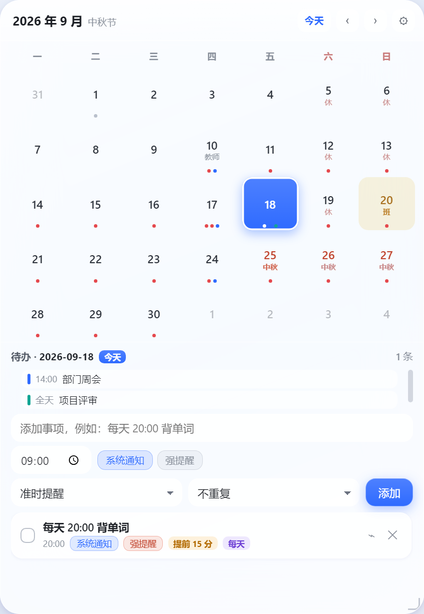

<div align="center">


# Kairos

**恰当时机** · 极简桌面日历与待办提醒

[](#)
[](#)
[](#)
[](#)
[](#许可)

一个常驻桌面的日历小卡片。不用打开任何应用，抬眼就能看到今天有什么安排。

</div>

---

## 为什么叫 Kairos

希腊语里有两个「时间」：*chronos* 是滴答流逝的物理时间，*kairos* 是**恰当时机**——那个该做某事的瞬间。

提醒类工具真正要解决的从来不是「现在几点」，而是「什么时候该想起这件事」。这就是这个名字的由来，也是这个图标的样子：一个缺口的时间环，环上那颗点就是「恰当时机」。

## 功能

**日历与待办**
- 常驻桌面的无边框玻璃拟态卡片，可自由拖动、8 方向缩放，位置尺寸自动记忆
- **农历与 24 节气**：格子下方显示农历日，传统节日与节气自动替换（配色区分）；农历走系统内置 ICU 历法，节气由太阳视黄经算出
- **深色模式**跟随系统，也可在设置里强制浅色 / 深色
- **日历贴着桌面**：默认不压在工作窗口上面，切到别的程序时会被盖住，只在看桌面时出现；设置里可改回「始终置顶」
- 待办支持重复规则（每天 / 工作日 / 每周 / 每月）与提前提醒量（准时 / 提前 5 / 15 / 30 分钟）
- 日历格子上用彩色圆点区分提醒级别，一眼看出哪天有事

**提醒通道（每条待办独立开关）**

| 系统通知 | 强提醒 | 行为 |
| :---: | :---: | --- |
| ✅ | ❌ | 到点弹 Windows 通知，不打断你 |
| ❌ | ✅ | 到点弹应用内强提醒窗口 |
| ✅ | ✅ | **先弹通知；5 分钟后仍未处理，升级成强提醒窗口** |
| ❌ | ❌ | 只在日历上记一笔，不打扰 |

列表里的两个标签**直接点就能改**，不用删了重建。

**法定节假日**
- 内置国务院办公厅发布的放假安排，放假标红、**调休补班的周末标「班」**
- 覆盖 2025 / 2026 年。无数据的年份会自动降级为「只标公历节日」，不瞎编

**电脑日历同步**
- **Outlook 直连**：探测到本机 Outlook 桌面版就直接读，不需要导出
- **ICS 文件**：选一个 `.ics` 文件即可
- **ICS 订阅**：粘贴 `webcal://` 或 `https://` 订阅地址，定时自动拉取
- 多源并存，每个源独立开关与配色；**同步失败只记录原因，不清空已有数据**

## 截图

<div align="center">



</div>

> 「今天」高亮为蓝色，中秋三天标红，9/20 那个周日标「班」（国庆调休补班），
> 待办下方是同步进来的当天日程。

## 快速开始

### 安装

从 [Releases](../../releases) 下载 `Kairos-x.y.z-setup.exe` 双击安装。

安装包**未做代码签名**，Windows SmartScreen 会提示「未知发布者」，点「更多信息 → 仍要运行」即可。

安装时可以自选目录；**卸载不会删除你的数据**（待办、布局、设置都留在 `%APPDATA%\Kairos\`）。

### 从源码运行

```bash
git clone <this-repo>
cd Kairos
npm install
npm run dev      # 开发模式，带热更新
```

需要 Node.js ≥ 18。

## 使用

启动后是一个停在主屏右上角的日历卡片：按住头部拖动、拖右下角缩放，位置会自动记住。

| 操作 | 方式 |
| --- | --- |
| 打开 / 收起设置 | 卡片右上角齿轮 |
| 日历是否压住别的窗口 | 设置 → 「日历贴着桌面」（关掉即始终置顶） |
| 农历节气 / 深色 / 节假日 | 设置面板里各有开关 |
| 显示 / 隐藏日历 | 托盘图标左键单击，或 `Alt+Space` |
| 添加待办 | 选中日期 → 填标题 → 选时间和提醒通道 → 添加 |
| 改提醒方式 | **直接点待办行上的「系统通知」/「强提醒」标签** |
| 退出 | 托盘图标右键 → 退出 |

日历卡片可以贴着屏幕边缘吸附；把窗口拖到屏幕外也不用担心，下次启动会自动拉回来。

## 开发

```
src/
├── main/            主进程
│   ├── index.ts         入口：单实例锁、数据目录迁移
│   ├── ipc.ts           IPC 注册、托盘回调、提醒分发
│   ├── logger.ts        同步落盘日志（排查启动问题全靠它）
│   ├── services/
│   │   ├── todoService.ts     待办与提醒调度（两段式升级在这里）
│   │   ├── holidays 相关      → src/shared/holidays.ts
│   │   ├── calendarSync.ts    日历同步源管理与拉取
│   │   ├── icsParser.ts       自写的 ICS 解析器（零依赖纯函数）
│   │   ├── outlookService.ts  通过命令行脚本读 Outlook COM
│   │   ├── settingsService.ts / autostart.ts / displayService.ts / cardStore.ts
│   └── windows/
│       ├── calendarWindow.ts  日历窗 + 尺寸补偿
│       └── reminderWindow.ts  强提醒弹窗
├── preload/         contextBridge 白名单 API
├── renderer/        两个渲染入口
│   ├── index.html      日历主窗
│   ├── reminder.html   强提醒弹窗
│   └── src/{calendar,reminder,components,hooks,lib,styles}
└── shared/          类型、IPC 通道常量、节假日库、重复规则
```

### 几个设计决定

- **两个渲染入口**：强提醒是一个独立小窗，不复用日历窗，避免提醒弹窗被日历窗的状态影响。
- **自写 ICS 解析器**：要打进单文件 `app.asar`，少一个运行时依赖就少一处打包坑；而且它是零依赖纯函数，可以脱离 Electron 直接单元测试。
- **窗口尺寸补偿**：Windows 上无边框透明窗口的实际 bounds 会比请求值多几个像素。不补偿的话，每次拖拽缩放都会累积漂移。所有补偿都在主进程内部消化，对外只暴露「名义几何」。
- **提醒调度放主进程**：渲染层被回收（窗口隐藏、崩溃重建）都不会漏掉提醒。

## 测试

```bash
npm run verify          # 一条命令跑完全部
```

| 命令 | 内容 |
| --- | --- |
| `npm run typecheck` | 主进程 + 渲染层双工程类型检查 |
| `npm run test:unit` | 40 项：节假日判定 + 农历节气 + ICS 解析（纯函数，不用启动 Electron） |
| `npm run test:reminders` | 17 项：提醒调度，含四种提醒通道组合与两段式升级 |
| `npm run test:tray` | 5 项：强提醒数据通道、测试提醒不污染真实数据 |
| `npm run test:sync` | 13 项：ICS 真实文件 → 缓存 → IPC 全链路 |
| `npm run test:window` | 10 项：窗口层级（日历不置顶、提醒必置顶） |
| `npm run smoke` | 渲染冒烟 + 尺寸守卫（圆点尺寸、子元素溢出），并导出预览图便于人工核对 |

测试都是**跑真实主进程、读回数据断言**，不是 mock 到失去意义的那种。

带「等 N 分钟」语义的逻辑留了环境变量口子方便测试：`KAIROS_TICK_MS`（调度轮询间隔）与 `KAIROS_ESCALATE_MS`（通知→强提醒的升级延迟）。

## 打包

```bash
npm run icons                              # 生成各尺寸图标
KAIROS_OUT_DIR=out npm run build           # 出 JS 产物
npm run clean:artifacts                    # 清掉历史构建的孤儿文件
node scripts/run.mjs electron-builder --win nsis --publish never
```

产物在 `release/`。

> `clean:artifacts` 不能省：验证构建用 `emptyOutDir: false`（为了在受限环境里避开目录清空），
> 代价是每次构建的旧文件会留在 `assets/` 里，最后被一起打进安装包。

## 数据与隐私

**全部数据都在你本机**，没有任何遥测、没有任何上传：

```
%APPDATA%\Kairos\
├── todos.json          待办
├── card.json           卡片位置与尺寸
├── settings.json       设置
├── syncSources.json    日历同步源
├── syncEvents.json     同步来的日程缓存
└── kairos.log          运行日志
```

唯一会联网的场景是你主动添加了 ICS 订阅地址（去拉那个地址的内容）。
Outlook 直连完全走本地 COM 接口。

## 已知限制

1. **节假日数据要每年手工补**。国办每年 11 月左右发布次年安排，目前有 2025 / 2026。没数据的年份只标公历节日。
2. **暂只支持中国节假日**。数据结构已按地区预留，加其他国家补一张区间表即可。
3. **ICS 不做完整时区换算**。带 `TZID=` 的事件按本地时间理解（带 `Z` 的 UTC 会正确换算）。
4. **不支持 `EXDATE` / `BYSETPOS`** 这类复杂重复规则，遇到会退化成单次事件（不会崩）。
5. 仅提供 Windows 安装包；代码本身跨平台，但没有针对 macOS / Linux 做适配与测试。

## 路线图

- [ ] 农历与节气显示
- [ ] 更多国家 / 地区节假日
- [ ] 待办拖动排序与分组
- [ ] 深色模式跟随系统
- [ ] 日历订阅的双向同步（目前只读）

## 许可

[MIT](LICENSE) © 2026 Kairos
